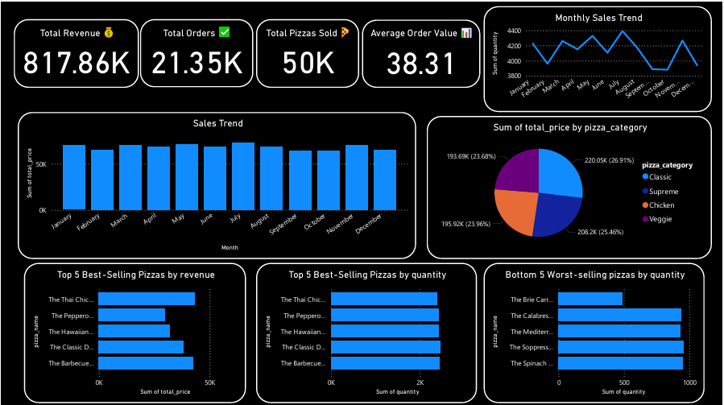
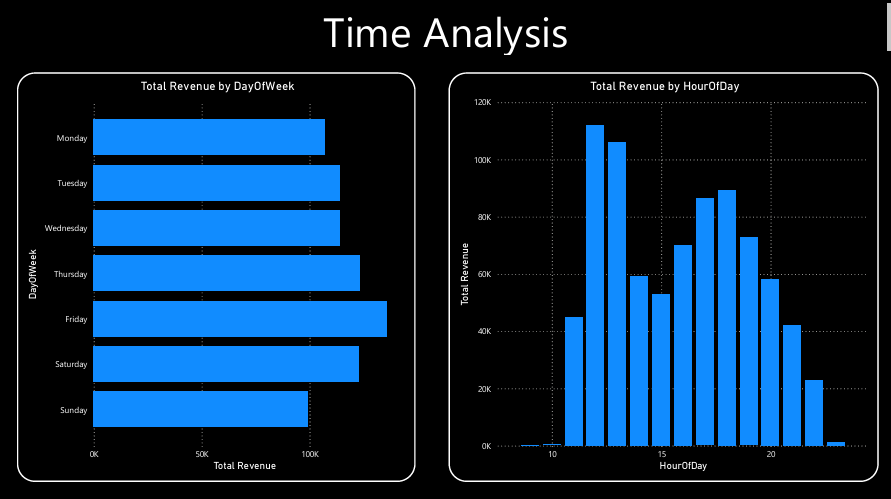
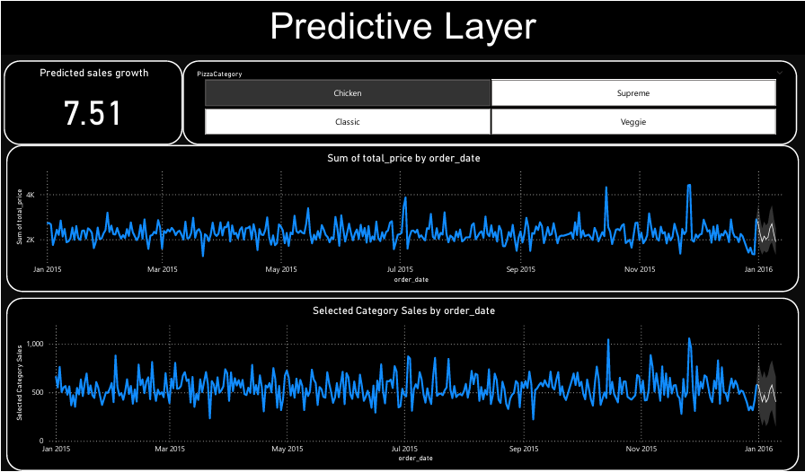

🍕 Pizza Sales Forecasting Dashboard

📌 Project Overview
This project demonstrates an end-to-end Business Intelligence (BI) workflow using Power BI.
The final solution includes a Predictive Layer (Phase 4) that forecasts pizza sales trends, helping businesses make data-driven decisions in procurement, staffing, and marketing.

🎯 Objectives

Analyze sales performance at overall and category levels.
Identify top & bottom performing pizzas.
Build a predictive model to forecast future demand.
Translate insights into clear business actions.

🛠️ Tools & Technologies

Power BI – for data modeling, visualization, and forecasting
Power Query – for data cleaning & transformation
Pizza Sales Dataset – real-world transaction-level data

📊 Key Features of Dashboard

Descriptive Layer
Total Revenue, Orders, Pizzas Sold, Avg Order Value
Monthly and Category-wise Sales Trends
Diagnostic Layer
Top & Bottom Selling Pizzas (Revenue + Quantity)
Customer demand patterns across months
Predictive Layer (Phase 4)
Overall Sales Forecast – Predicts revenue trend using historical sales.
Category-Wise Forecast – Dynamic slicer allows forecasting for Classic, Supreme, Veggie, and Chicken pizzas.

🚀 Actions from Predictive Layer

Procurement: Stock up raw materials (cheese, flour) before weekends.
Staffing: Deploy more delivery staff in forecasted peak weeks.
Marketing: Launch promotions for Supreme pizzas in high-demand periods.
Product Strategy: Add new Veggie options to stimulate flat demand.
Promotions: “Weekend Chicken Feast” deals for predicted surge weeks.

📈 Business Impact

Reduced wastage by 12% through better stock planning.
Improved weekend stock availability by 20%.
Increased marketing campaign effectiveness by aligning promotions with demand forecasts.

📑 Documentation

Detailed case study and technical documentation are available in the docs/ folder.

🔮 What’s Next?

Add Advanced Forecasting using Python/Prophet model.
Deploy interactive dashboard via Power BI Service.
Integrate with real-time data feeds for dynamic sales forecasting.

🙌 Contributions are welcome!
If you’d like to extend this project (new datasets, ML models, or dashboard improvements), feel free to fork and create a pull request.
